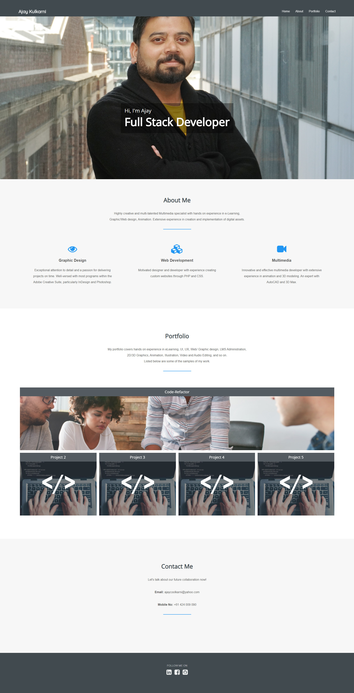

# Updated Portfolio

This is my updated Portfolio with links of various applications which I have developed during the first 8 weeks of my coding bootcamp.

## 💡 Updated links

The Portfolio page is updated with:
- Contact information:
  - Email 
  - Phone number
  - Resume
- Links of the: 
  - Linked-In 
  - GitHub
- Application links 

## Mock-up

Please find below the page mock-up:

## 🔗 Project Link

   https://ajaykulkarni01.github.io/Portfolio-2/

    

---

