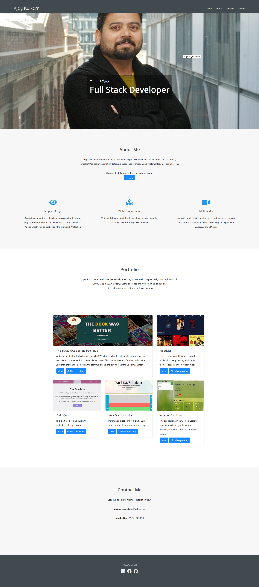

# 02 Advanced CSS: Portfolio

For this project, I've developed a portfolio page from scratch. 

This is my second week of the bootcamp. In this week, I learnt some of the advanced CSS skills like flexbox, media queries, and CSS variables. I've used these skills while working on my portfolio. 

## 💡 Development details

In the header section of the page you can find my name and navigation links. The navigation links are Home, About, Portfolio and Contact. I've created the favicon for the page using Photoshop. It is a logo that starts from the letter "A".

In the 'Head' element of the page I've linked the webfonts and Font awesome as I've used this in the page. 

After header, I've added the Herom banner image. This is my recent photo but I had to do lot of editing to make the perfect hero banner image. I've used the Photoshop to edit hero banner image. I've used the display-flex property to make the hero banner responsive.

Next, it was the About me section. I've used font awesome icon to highlight my 3 main skills - Graphic design, Web development and Multimedia. The page was looking very dull without any image for this section. Hence, I though of using the font awesome icons.

After this it was the portfolio section. To make this section responsive I've used the flexbox model. Out of the 5 projects, only first project is ready at this point. Hence, I've added the placeholder images for 4 projects and linked them to the project 1 link-page. I will update this with the latest links as I'll progress through the bootcamp.

Next, we have contact us and footer section. This section has all my current contact details and the link of my social media pages like - Facebook, Linkedin and Github.

I've tested and confirmed that the page is responsive through various screen resolutions and devices. 

## Mock-up

Please find below the page mock-up:

## 🔗 Project Link

   https://ajaykulkarni01.github.io/Portfolio/

    

---

